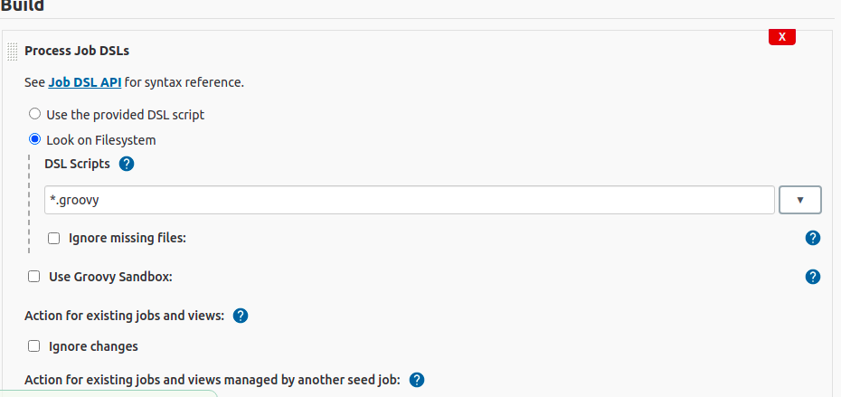
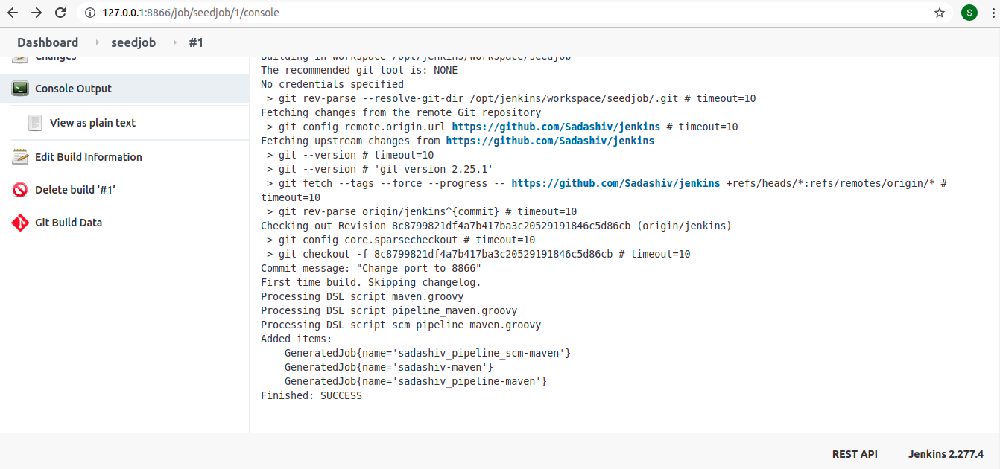
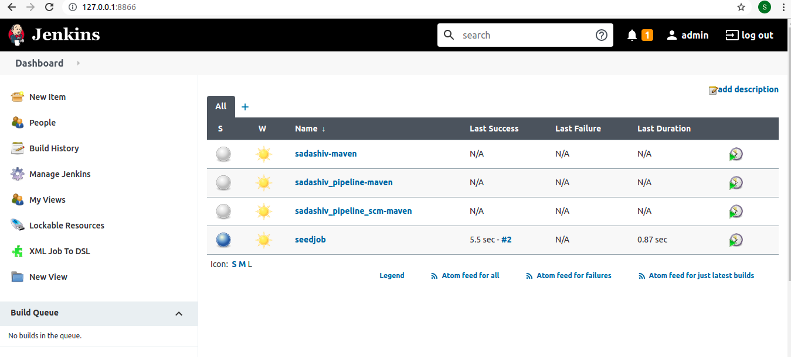

Jenkins Installation
====================

Prerequiste: Install jdk/jre 1.8

1. Clone git repo: https://github.com/Sadashiv/jenkins

2. run ./start_jenkins.sh

2. Install plugin
   Job DSL
   XML Job to Job DSL(Convert normal job to DSL code)

api to access: http://127.0.0.1:8866/plugin/job-dsl/api-viewer/index.html
Jenkins job api for each xml tag or activity: https://jenkinsci.github.io/job-dsl-plugin/

Create jenkins slave with private key
Manage Jenkins -> Manage Credentials -> Create new credentials and during slave creation use this credential

sudo cp jenkins.service /lib/systemd/system/
sudo systemctl enable jenkins.service
sudo systemctl start jenkins.service

Access in browser: http://127.0.0.1:8866/

Create seed job
Seed Job: That depends on context. Jenkins itself does not provide "seed jobs".

Update git repo in seed job: https://github.com/Sadashiv/jenkins(Select branch name: jenkins)

Build step-> Process job DSLs and select Look fulesystem -> *.groovy 

Save and build job will see below job generated

Warning: ERROR: script not yet approved for use
http://127.0.0.1:8866/scriptApproval/
Go head and approve
or

Disable script Approval-> Manage Jenkins->Configure System->disable scritp test

Run seed Job to generate the jobs

Dashboard of jobs generated and can be run these jobs

ToDo
====
Jenkins Agent creation
Create groovy code to run for different stages with activity
Develop the utility to create different jobs
